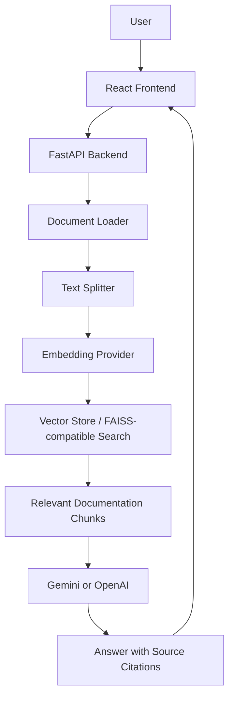

# DevOps RAG Assistant

DevOps RAG Assistant is a Retrieval-Augmented Generation (RAG) application that works like a junior DevOps engineer. A user can paste an error message, cloud issue, container failure, or log output, and the system retrieves relevant documentation before generating a practical troubleshooting answer with source citations.

The project is designed as a portfolio-ready AI engineering and DevOps project using FastAPI, React, local document ingestion, vector search, and Gemini/OpenAI integration.

## Table of Contents

- [Overview](#overview)
- [Key Features](#key-features)
- [Architecture](#architecture)
- [RAG Pipeline](#rag-pipeline)
- [Technology Stack](#technology-stack)
- [Project Structure](#project-structure)
- [API Endpoints](#api-endpoints)
- [Environment Configuration](#environment-configuration)
- [Run Locally](#run-locally)
- [Knowledge Base](#knowledge-base)
- [Security Notes](#security-notes)
- [Limitations](#limitations)
- [Future Improvements](#future-improvements)
- [CV Description](#cv-description)

## Overview

Traditional DevOps troubleshooting often requires searching AWS documentation, Docker references, Kubernetes guides, Stack Overflow posts, and old logs. This application automates the first step of that workflow.

Example user input:

```text
Error: AccessDenied: User is not authorized to perform s3:PutObject
```

Example generated output:

```text
Possible cause:
The IAM role or user does not have s3:PutObject permission for the target S3 object ARN.

Suggested fix:
Add an IAM policy that allows s3:PutObject on arn:aws:s3:::my-bucket/*

Source:
aws/iam.txt
```

## Key Features

- Chat with DevOps documentation
- Analyze infrastructure and application logs
- Upload PDF, TXT, and Markdown documents
- Retrieve relevant documentation chunks using vector search
- Generate final answers with Gemini or OpenAI
- Return source citations for transparency
- Store starter knowledge for AWS, Docker, Kubernetes, and logs
- Provide a React frontend with Chat, Upload, Error Analysis, and History pages
- Run locally with simple PowerShell scripts
- Continue working in fallback mode when no LLM key is configured

## Architecture



## RAG Pipeline

RAG stands for Retrieval-Augmented Generation. Instead of sending only the user's question to the LLM, the backend first retrieves relevant local documentation and then sends that context to the model.

### 1. Document Ingestion

The app reads files from:

```text
knowledge_base/
```

Supported formats:

- `.txt`
- `.md`
- `.pdf`

Uploaded documents are stored in:

```text
knowledge_base/uploads/
```

### 2. Text Splitting

Large documents are split into smaller overlapping chunks so the retriever can find the most relevant section.

```python
chunks = split_text(document, chunk_size=500, overlap=80)
```

### 3. Embedding Generation

Each chunk is converted into a vector embedding. An embedding is a numerical representation of text meaning.

Default setup:

- Lightweight built-in hash embedding fallback

Optional ML setup:

- `sentence-transformers/all-MiniLM-L6-v2`
- FAISS CPU index

### 4. Retrieval

When a user asks a question, the backend embeds the query and compares it with stored document vectors.

Example:

```text
Query: AccessDenied s3:PutObject
Top result: knowledge_base/aws/iam.txt
```

### 5. Answer Generation

The backend sends the user query and retrieved context to the selected LLM provider. The model returns a concise troubleshooting answer with source citations.

## Technology Stack

| Layer | Tools |
| --- | --- |
| Frontend | React, Vite, Tailwind CSS, Lucide React |
| Backend | Python, FastAPI, Uvicorn, Pydantic Settings |
| Document Parsing | PyPDF, text file loaders |
| Retrieval | Lightweight embeddings, optional Sentence Transformers |
| Vector Search | Built-in vector search, optional FAISS |
| LLM Providers | Gemini REST API, OpenAI SDK |
| Runtime Scripts | PowerShell |

## Project Structure

```text
devops-rag-assistant/
  backend/
    app/
      api/
      core/
      models/
      rag/
      main.py
    storage/
    requirements.txt
    requirements-ml.txt
    .env.example

  frontend/
    src/
      components/
      lib/
      pages/
      App.jsx
      main.jsx
      styles.css
    package.json

  knowledge_base/
    aws/
    docker/
    kubernetes/
    logs/

  scripts/
    run_backend.ps1
    run_frontend.ps1
```

## API Endpoints

### Health Check

```http
GET /health
```

Example response:

```json
{
  "status": "ok",
  "indexed_chunks": 12,
  "llm_provider": "gemini"
}
```

### Upload Documentation

```http
POST /upload
```

Uploads and indexes a PDF, TXT, or Markdown file.

Example response:

```json
{
  "filename": "iam-guide.pdf",
  "chunks_added": 18,
  "message": "Document uploaded and indexed."
}
```

### Chat

```http
POST /chat
```

Request:

```json
{
  "query": "Why am I getting AccessDenied for s3:PutObject?"
}
```

Response:

```json
{
  "answer": "Possible cause...",
  "sources": [
    {
      "source": "aws/iam.txt",
      "score": 0.397,
      "text": "IAM access denied errors usually mean..."
    }
  ]
}
```

### Analyze Logs

```http
POST /analyze-log
```

Request:

```json
{
  "log": "CrashLoopBackOff: back-off restarting failed container"
}
```

## Environment Configuration

Create a local environment file:

```text
backend/.env
```

Use `backend/.env.example` as a template.

### Gemini Free Plan

```env
LLM_PROVIDER=gemini
GEMINI_API_KEY=your_gemini_api_key_here
GEMINI_MODEL=gemini-3.5-flash
```

The Gemini free plan has low rate limits, so quota errors can happen after repeated requests.

### OpenAI

```env
LLM_PROVIDER=openai
OPENAI_API_KEY=your_openai_api_key_here
OPENAI_MODEL=gpt-4o-mini
```

### Fallback Mode

```env
LLM_PROVIDER=none
```

Fallback mode still retrieves matching source documents, but it does not call an external LLM.

## Run Locally

Open two PowerShell windows.

### Backend

```powershell
cd C:\path\to\devops-rag-assistant
.\scripts\run_backend.ps1
```

Backend:

```text
http://127.0.0.1:8000
```

API docs:

```text
http://127.0.0.1:8000/docs
```

### Frontend

```powershell
cd C:\path\to\devops-rag-assistant
.\scripts\run_frontend.ps1
```

Frontend:

```text
http://127.0.0.1:5173
```

## Optional Full ML Setup

The default setup is intentionally lightweight. For stronger semantic retrieval, install the optional ML dependencies:

```powershell
cd C:\path\to\devops-rag-assistant\backend
.\.venv\Scripts\pip install -r requirements-ml.txt
```

This enables:

- `sentence-transformers/all-MiniLM-L6-v2`
- FAISS CPU index
- Higher-quality semantic retrieval

## Knowledge Base

Starter documents are included for common DevOps troubleshooting domains:

```text
knowledge_base/
  aws/
    iam.txt
    s3.txt
    ec2.txt
    lambda.txt
    vpc.txt
    cloudwatch.txt
  docker/
    build_errors.txt
    networking.txt
  kubernetes/
    pods.txt
    deployments.txt
  logs/
    nginx_errors.txt
    lambda_errors.txt
```

## Security Notes

- Do not commit `backend/.env`.
- Keep API keys out of Git history.
- Rotate any key that appears in logs, screenshots, terminal output, or commits.
- Use placeholders only in `.env.example`.
- Uploaded files are stored locally under `knowledge_base/uploads/`.

## Limitations

- The default embedding fallback is less accurate than transformer embeddings.
- Chat history is stored only in the browser session.
- There is no authentication system.
- Uploaded documents are indexed locally only.
- Gemini free-plan quota may limit repeated testing.
- The app is currently designed for local development.

## Future Improvements

- Add persistent history with SQLite or PostgreSQL
- Add user accounts and authentication
- Add ChromaDB or Pinecone support
- Add Docker Compose
- Add streaming LLM responses
- Add better metadata-aware chunking
- Add source highlighting in the frontend
- Add retrieval quality tests
- Add Ollama local model support
- Add CI/CD with GitHub Actions
- Deploy to a cloud provider

## CV Description

Built a DevOps-focused RAG assistant using FastAPI, React, Tailwind CSS, local document ingestion, vector search, and Gemini/OpenAI integration. The system retrieves relevant AWS, Docker, Kubernetes, and log documentation from a local knowledge base and generates troubleshooting guidance with source citations.
